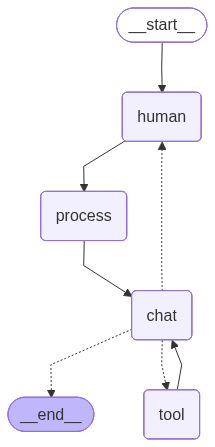

# 🤖 Telegram AI Chatbot with Persistent Memory

A production-grade conversational AI chatbot powered by LangGraph, integrated with Telegram. Unlike typical stateless chatbots, this bot maintains **persistent memory across sessions** using a dual-database architecture — remembering every user's conversation history forever.

---

## 🧠 How This Differs from a Usual Chatbot

### Typical Chatbot Workflow
```
User sends message
        ↓
LLM generates response (no memory of past)
        ↓
Response sent back
        ↓
Conversation forgotten ❌
```

Every message is treated in isolation. The bot has no idea what was said before unless you manually pass the entire chat history every time — which most simple bots don't do.

---

### This Bot's Workflow
```
User sends Telegram message
        ↓
chat_id used as unique thread_id (per user memory)
        ↓
LangGraph graph invoked
        ↓
human_node → reads message from state
        ↓
process_node → fetches last 10 messages from SQLite (recent context)
             → fetches semantically relevant past messages from Chroma (long-term memory)
        ↓
chat_node → LLM generates response using:
            - recent conversation
            - semantically relevant past context
            - tool results (if any)
        ↓
        ├── If LLM calls a tool → tool_node → back to chat_node
        └── If final response → save to SQLite + Chroma → send to Telegram
```

Every conversation is remembered. Every user gets their own isolated memory. The bot gets smarter about each user over time.

---

## 📁 Project Structure

```
telegram-chatbot/
├── bot.py          # Telegram bot entry point
├── graph.py        # LangGraph graph definition and nodes
├── schemas.py      # State definition, LLM, tools, database setup
├── prompts.py      # System prompt for the LLM
├── queries.py      # All SQL queries
├── .env            # API keys 
├── requirements.txt
└── README.md
```

---

## 🗄️ Database Architecture

This bot uses **three separate databases**, each serving a distinct purpose:

---

### 1. SQLite — Conversation History (`conv0.db`)

**Purpose:** Stores every message (human and assistant) with timestamps.

**Schema:**
```sql
CREATE TABLE conversations (
    id        INTEGER PRIMARY KEY AUTOINCREMENT,
    thread_id TEXT,     -- Telegram chat_id, unique per user
    role      TEXT,     -- 'human' or 'assistant'
    message   TEXT,     -- actual message content
    timestamp REAL      -- Unix timestamp for ordering
);
```

**How it's used:**
- Every message is saved immediately after it occurs
- On each new message, the **last 10 messages** are fetched (ordered oldest to newest) to give the LLM recent conversational context
- A cleanup query automatically keeps only the **last 20 messages** per user to prevent unbounded growth

**Why SQLite:**
- Fast, lightweight, zero configuration
- Perfect for ordered retrieval by timestamp
- Built into Python — no external service needed

---

### 2. Chroma Vector Store — Semantic Memory (`vectorstore/`)

**Purpose:** Stores all messages as vector embeddings for semantic (meaning-based) search.

**How it works:**
- Every message is converted to a **384-dimensional vector** using the `all-MiniLM-L6-v2` HuggingFace embedding model
- These vectors are stored in Chroma with metadata: `role`, `thread_id`, `timestamp`
- On each new message, a **similarity search** finds the 10 most semantically relevant past messages — even if they were said weeks ago

**Why this matters:**
```
User on Day 1:  "I love cricket, especially Test matches"
User on Day 30: "What sport should I watch this weekend?"

→ Chroma finds Day 1 message as semantically relevant
→ Bot recommends cricket without being told again ✅
```

**Why Chroma:**
- Local, persistent vector store
- Fast similarity search
- Easy LangChain integration

---

### 3. SQLite — LangGraph Checkpoints (`checkpoint.db`)

**Purpose:** Stores LangGraph's internal state snapshots for each thread.

**How it works:**
- LangGraph uses this automatically via `SqliteSaver`
- After each graph execution, the full state is saved
- On next invocation with the same `thread_id`, LangGraph can resume from where it left off

**Why it's needed:**
- Provides LangGraph-level continuity between separate graph invocations
- Works alongside the conversation DB for complete memory persistence

---

## ⚙️ How the LangGraph Workflow Works

The bot is built as a **directed state graph** using LangGraph:

```
         [START]
            ↓
      [human_node]
      Reads message from state
            ↓
      [process_node]
      Fetches recent chats (SQLite)
      Fetches relevant chats (Chroma)
            ↓
       [chat_node]
       Builds system prompt with context
       Calls LLM
            ↓
    ┌───────┴───────┐
    ↓               ↓
tool called?    final response?
    ↓               ↓
[tool_node]       [END]
DuckDuckGo    Save to DBs
search        Send to Telegram
    ↓
[chat_node]
(with tool results)
```
## 🗺️ Graph Visualization



```

### Nodes Explained

| Node | Role |
|---|---|
| `human_node` | Reads user input from state, saves to DB |
| `process_node` | Retrieves recent + relevant context from both DBs |
| `chat_node` | Calls LLM with full context, handles tool calls |
| `tool_node` | Executes tools (DuckDuckGo search), returns results |


---

## 🔧 Tools

### DuckDuckGo Search
The LLM has access to real-time web search. It automatically uses this tool when:
- Asked about current events, news, sports scores
- Information is beyond its October 2023 training cutoff
- User asks about anything recent

```
User: "Who won IPL 2025?"
        ↓
LLM decides to search
        ↓
tool_node runs DuckDuckGo search
        ↓
Results returned to chat_node
        ↓
LLM answers using real search results ✅
```

---

## 📱 Telegram Integration

### Why Telegram as a Frontend
Instead of building a custom UI, Telegram acts as a **ready-made chat interface**:
- No frontend development needed
- Works on mobile, desktop, and web
- Each user automatically gets their own isolated memory via `chat_id`

### How It Works

```
User sends message on Telegram
        ↓
python-telegram-bot receives it via polling
        ↓
handle_message() extracts:
  - user_message (the text)
  - chat_id (used as thread_id)
        ↓
LangGraph graph invoked with this state
        ↓
Response returned in output['latest_response']
        ↓
Bot sends reply back to user on Telegram ✅
```

### Per-User Memory via chat_id

```python
thread_id = str(update.message.chat_id)
# Every Telegram user has a unique chat_id
# This becomes their thread_id in LangGraph
# All their history is stored and retrieved using this ID
```

- Your chat_id: always the same number for your account
- Friend's chat_id: completely different number
- Their conversations never mix ✅

---

## 🚀 Setup & Running

### 1. Clone the repo
```bash
git clone https://github.com/YOUR_USERNAME/telegram-chatbot.git
cd telegram-chatbot
```

### 2. Create virtual environment
```bash
python3 -m venv botenv
source botenv/bin/activate  # Linux/Mac
botenv\Scripts\activate     # Windows
```

### 3. Install dependencies
```bash
pip install -r requirements.txt
```

### 4. Set up environment variables
```bash
# Edit .env and add your keys
```

```
GROQ_API_KEY=your_groq_api_key_here
TELEGRAM_BOT_TOKEN=your_telegram_bot_token_here
```

### 5. Run the bot
```bash
python bot.py
```

---

## 🔑 Environment Variables

| Variable | Description | Where to get |
|---|---|---|
| `GROQ_API_KEY` | API key for Groq LLM | console.groq.com |
| `TELEGRAM_BOT_TOKEN` | Telegram bot token | @BotFather on Telegram |

---

## 📦 Tech Stack

| Component | Technology |
|---|---|
| LLM | Kimi-K2 via Groq API |
| Orchestration | LangGraph |
| Recent Memory | SQLite |
| Semantic Memory | Chroma + HuggingFace Embeddings |
| Checkpointing | LangGraph SqliteSaver |
| Web Search | DuckDuckGo |
| Telegram Interface | python-telegram-bot |
| Embeddings | all-MiniLM-L6-v2 |

---

## 📝 Notes

- The bot uses **polling** mode — no webhook or public server required for local development
- Databases (`*.db`) and vector store (`vectorstore/`) are auto-created on first run
- Each user's data is completely isolated via their Telegram `chat_id`
- The cleanup query keeps only the last 20 messages per user in SQLite to prevent DB growth
